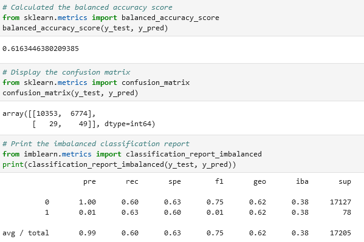
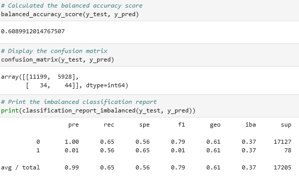
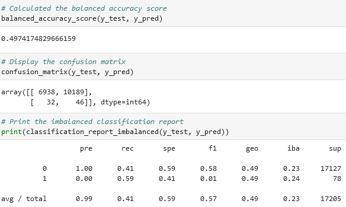
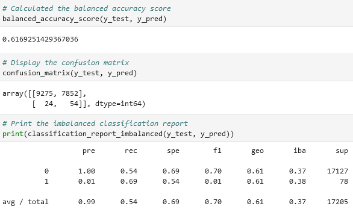

# Credit Risk Analysis

## Overview
<!-- Purpose of the analysis we performed -->
The purpose of this analysis is to apply the machine learning algorithms we have learned so far to predict credit lending risk based on numerous criteria. Additionally a comparison is made between under- and over-sampling, between logistic regression and ensemble classifiers. 

## Results

For this analysis we used six different combinations of machine learning techniques and computed their balanced accuracy score, confusion matrix, and classification report.
<!-- Bulleted List -->
<!-- Describe the balanced accuracy score and precision and recall of all six machine learning models -->
1. Logistic Regression with Naive Random Oversampling
	
	* The accuracy score was 61.2%
	* Total precision was 99%, and total recall was 60%
2. Logistic Regression with SMOTE Oversampling
	
	* The accuracy score was 60.9%
	* Total precision was 99%, and total recall was 65%
3. Logistic Regression with Clustered Centroids Undersampling
	
	* The accuracy score was 49.7%
	* Total precision was 99% and total recall was 41%
4. Logistic Regression with SMOTEENN
	
	* The accuracy score was 61.9%
	* Total precision was 99%, and total recall was 54%
5.
6.

## Summary
<!-- Quick overview of the results -->

<!-- Recommendation of a model, or no recommendation. Provide a justification -->
