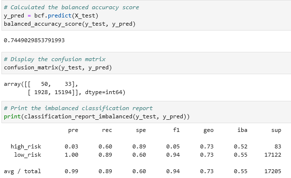
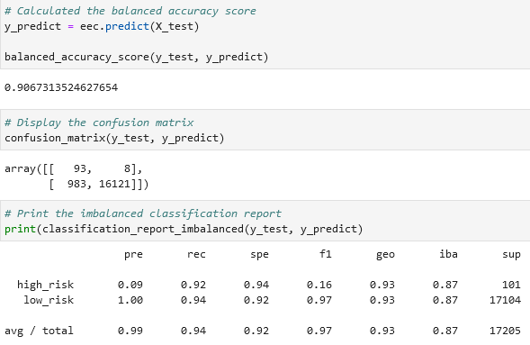

# Credit Risk Analysis

## Overview
<!-- Purpose of the analysis we performed -->
The purpose of this analysis is to apply the machine learning algorithms we have learned so far to predict credit lending risk based on numerous criteria. Additionally a comparison is made between under- and over-sampling, between logistic regression and ensemble classifiers. 

## Results

For this analysis we used six different combinations of machine learning techniques and computed their balanced accuracy score, confusion matrix, and classification report.
<!-- Bulleted List -->
<!-- Describe the balanced accuracy score and precision and recall of all six machine learning models -->
1. Logistic Regression with Naive Random Oversampling
	
	* The accuracy score was 61.2%
	* Total precision was 99%, and total recall was 60%
	* Decent at classifying high risk credit
2. Logistic Regression with SMOTE Oversampling
	
	* The accuracy score was 60.9%
	* Total precision was 99%, and total recall was 65%
	* A bit better than naive oversampling
3. Logistic Regression with Clustered Centroids Undersampling
	
	* The accuracy score was 49.7%
	* Total precision was 99% and total recall was 41%
	* Undersampling reduced ability to classify high risk credit
4. Logistic Regression with SMOTEENN
	
	* The accuracy score was 61.9%
	* Total precision was 99%, and total recall was 54%
	* Again it seems the undersampling reduced effectiveness of the model
5. Balanced Random Forest
	
	* The accuracy score was 74.5%
	* The total precision was 99%, and total recall was 89%
	* Random forest has a high total recall and performed much better than the logistic regression
6. Easy Ensemble with AdaBoost
	
	* The accuracy score was 90.7%
	* The total precision was 99%, and total recall was 94%
	* The best model by far, with under 1000 false negatives and only 8 false positives. 

## Summary
<!-- Quick overview of the results -->
Precision was near 100% for all models, but this is because there were so many more positive cases than negative cases. Overall the logistic regression performed a relatively poor job at properly classifying our data. Oversampling helped increase the recall somewhat but it never made it above 70%. Undersampling hurt performance, probably because of the highly imbalanced nature of the dataset. The ensemble classifiers performed much better, with the balanced random forest even reaching almost 90% recall. The time needed to fit the models was significantly longer for  the ensemle models however. 
<!-- Recommendation of a model, or no recommendation. Provide a justification -->
Given the much better performance of the ensemble models I would recomment the Easy Ensemble with AdaBoost. With a bit of tuning the recall could probably get over 95%.
